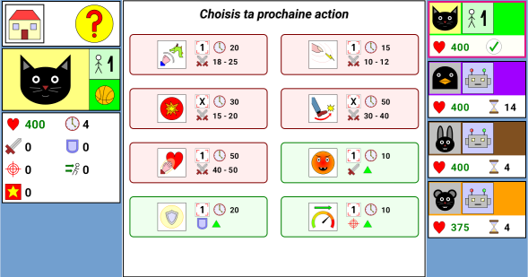

# Ultimate Cat Battle

Ultimate Cat Battle est un jeu de combat au tour par tour pour Android ayant pour vedettes un chat et un pingouin.

Ses caractéristiques principales sont :
- Mode 1 joueur (l'ordinateur contrôle le pingouin) ou mode 2 joueurs sur la même machine
- Gratuit, sans pub, nenécessite pasde connexion internet
- Rapide : une partie dure seulement quelques minutes
- Jouable pour tous à partir de 7 ans
- Disponible en anglais et en français

# Téléchargement et installation

Vous pouvez télécharger le package APK sur la page de release (vous devrez par contre au préalable configurer votre
smartphone ou tablette pour autoriser les installation tierces d'APK).

Si le jeu rencontre suffisemment de succès pour pouvoir atteindre le nombre de testeurs requis, j'essaierai de le publiser
sur le Google Play Store.

# Instructions du jeu

## Introduction

Le Chat et le Pingouin éprouvent une haine mutuelle ancestrale repontant à une centaine de générations. La cause de ce
conflit a été oubliée avec les temps, mais les flammes de la haine n'en son point éteintes pour autant.

Seuls survivants de leurs clans respectifs, ils décident de mettre un terme à ce conflit à l'issue d'un ultime combat dont
seul l'un d'entre eux en ressortira. Qui sera le vainqueur ? 

## Bases du jeu

Il y a 2 personnages : le chat (controllé par le premier joueur) et le pingouin (controllé par le second joueur en mode
2 joueurs ou par l'ordinateur en mode 1 joueur). Les deux personnages démarrent avec un certain nombre de points de vie.
Le but du jeu est de réduire les points de vie de l'adversaire à 0 avant qu'il n'en fasse de même pour vous.

Le nombre de points de vie de chaque personnage est situé à coté de l'icône en forme de coeur : 

Vous pouvez choisir deux types d'actions penvant votre tour :
- Les attaques, qui infligent des dégâts à l'adversaire (réduisent ses points de vie)
- Les actions de soutien, qui modifient vos caratéristiques (ex : augmenter les dégâts infligés, ...)

## Gestion du temps

La resource principale du jeu est le `temps`. Au début de la partie, un joueur est choisi au hasard et reçoit un nombre
aléatoire (inférieur à 20) d'unité de temps. Le nombre d'unité de temps restant pour un joueur avant que son tour finisse
est affiché près de l'icône en forme d'horloge : 

Chaque action coûte un nombre fixe d'unités de temps. Quand vous choisissez une action, si son coût en temps est inférieur
au temps restant imparti, vous pourrez effectuer une autre action, sinon votre tour se fini et celui de l'adversaire commence.

A l'exception du premier tour, le nombre d'unités de temps disponible est calculé en fonction de la différence entre le coût
de la dernière action faite par le joueur adverse et le temps restant dont il disposait avant d'effecuter cette action.
Par exemple :
- Le chat dispose de 15 unités de temps
- Le chat utilise l'action `Furie`, qui coûte 10 unités de temps. Il lui reste alors 5 unités de temps (15 unités initiales
moins 10 unités utilisées par l'action) et par conséquent peut continuer son tour.
- Le chat utilise ensuite l'attaque `Coup au coeur` qui coûte 50 unités de temps. Comme cette action a un coût plus élevé
que le nombre d'unités de temps restant, son tour se termine et le tour du pingouin commence. Au début du tour du pingouin,
celui-ci disposera de 45 unités de temps (50 unités de temps correspondant au coût de la dernière action du chat, moins
les 5 unites de temps restant du chat avant d'effectuer ce coup).

## Actions d'attaque

Les actions d'attaques sont représentées par les boutons rouges/roses dans l'écran de sélection des actions.

Comme leur nom l'indique, le but de ses actions est de réduire le nombre de points de vie de l'adversaire. Comme expliqué
dans la section précédente, ces attaques on un coût en unités de temps (notez que ce coût est appliqué indépendamment du
fait que l'attaque réussisse, soit critique ou échoue).

Par défaut l'interface de sélection d'action n'affichera que le nom de l'attaque est son coût en temps. Vous pouvez afficher
les caratéristiques détaillées des attaques en cliquant sur le bouton `+` : 

### Dégâts

Une information importante associée à une attaque est le montant des dégâts de base infligés. Chaque attaque a une plage
de valeurs à partir de laquelle le nombre de dégâts de base sera choisi au hasard (avant d'appliquer les modifieurs de dégâts).
La plage (min-max) de dégâts associée à une attaque peut être vue dans les détails à côté de l'icone représentant 2 épées
croisées : 

Les dégâts effectifs infligés dépendent également du modificateur d'attaque du joueur (positivement) et du modificateur de
défenre de l'adversaire (négativement). Ces mofificateurs sont en pourcents (%) et s'additionent, par exemple si l'attaquant
a un modificateur d'attaque de 25 (=25 %) et l'adversaire a un modificateur de défense de 25 (=25 %), les 2 modificateurs
s'annulent.

Le minimum de dégâts effectués est toujours de 1 (ce qui ne peut arriver que si l'attaquant a un modificateur d'attaque de
-50 % et l'adversaire a un modificateur de défense de 50 %).

### Chance de toucher

Les attaques peuvent échouer (et vous serez dépités quand ça arrivera, car vous ne ferez aucun dégât mais vous paierez quand
même le coût en temps). Lorsqu'un joueur effecute une attaque, un tirage aléatoire est effectué afin de savoir si l'attaque
va réussir ou non.

Chaque type d'attaque a une chance initiale de toucher, affichée dans les détails de l'attaque près de l'icône en forme de
cible de tir : 

Si une attaque a une chance initiale de toucher de 100, l'attaque va toujours réussir. Si sa chance de toucher est de 50,
elle ne réussira qu'une fois sur 2 (la probabilité est théorique, n'allez pas vous plaindre si vous n'avez pas de chance).

Comme pour les dégâts infligés, la chance de toucher peut être affectée par des modificateurs de status. Le taux de précision
de l'attaquant va augmenter cette chance (ex: 60 % de chance de toucher de l'attaque cumulé à 20 % de taux de précision
donnera 80 % de chance de réussir l'attaque), alors qu'au contraire le taux d'esquive du défenseur va la diminuer (ex: 60 %
de chance de toucher de l'attaque cumulé cumulé à 10 % du taux d'esquive du défenseur donnera 50 % de chances de réussir
l'attaque).

### Chance de coup critique

Si vous êtes chanceux, les attaques peuvent effectuer des coups critiques, ce qui augmente les dégâts infligés de 50 % (
après applications des modificateurs) pour le même coût en temps.

Le fait qu'une attaque soit un coup critique est calculé *après* le fait qu'une attaque réussisse ou non. Même si vous aviez
100 % de chances d'effectuer un coup critique, ça n'aura aucun effet si votre attaque échoue.

Chaque attaque a une chance initiale (en pourcent) d'effectuer un coup critique, affichée dans les détails de l'attaque à
côté de l'icône en forme d'étoile : 

La chance de coup critique est également affectée par le modificateur de coup critique de l'attaquant (ex : 10 % chance
de critique de l'attaque cumulée à un modificateur de critique de 20 % donnera 30 % de chances d'effectuer un coup critique).
Contrairement aux dégâts et aux chances de réussir, le défenseur n'a pas de modificateurs qui peuvent faire baisser la chance
de coup critique de l'attaquant.

## Actions de soutien

Les actions de soutien sont réprésentées par les boutons verts dans l'écran de sélection des actions.

Une action de soutien applique au joueur un ensemble de modificateurs qui expirent au bout d'un nombre fixe d'unités de temps (coût
de l'action + 100 unités de temps). Vous pouvez cumuler autant de modificateurs que vous voulez, cependant une limite est
appliquée à la somme totale de chaque modificateur actif (total minimum : -50 %, total maximum : +50 %). Par exemple si
vous avez appliqué `Furie` 3 fois, votre modificateur d'attaque total ne sera que de 50 % au lieu de 75 %, cependant lorsque
l'effet de la première `Furie` aura expiré, le modificateur d'attaque sera toujours de 50 % jusqu'à ce que l'effet de la
deuxième expire.

Les actions de soutien n'apportent pas que des effets positifs, ainsi la plupart appliquent un modificateur positif
sur des caratéristiques et en contrepartie un modificateur négatif sur d'autres. Par exemple `Furie` va augmenter l'attaque
mais baisser la défense, alors que `Garde` fera l'inverse.

Avant d'effectuer une action de soutien, vous devez vérifier au préalable si les effets positifs compensent les effets
négatifs (n'oubliez pas la limite des 50 %) et son coût en temps (qui aurait pu être utilisé pour effectuer une attaque).

Par défaut l'interface de sélection des actions n'affichera que son nom et son coût en unités de temps. Vous pouvez afficher
les caratéristiques détaillées des soutiens en cliquant sur le bouton `+` : 

Vous pouvez voir le total des modificateurs appliqués sur chaque personnage dans l'écran principal, en dessous du nombre
de point de vie. Il y a 5 types de modificateurs :

- Modificateur d'attaque (augmente les dégâts infligés) : 
- Modificateur de défense (diminue les dégâts subis) : 
- Modificateur de précision (augmente le taux de réussite des attaques) : 
- Modificateur d'esquive (diminue le taux de réussite des attaques adverses) : 
- Modificateur de critique (augmente la chance de coup critique) : 

## Conclusion

Comme on dit, c'est en jouant qu'on apprend, donc le meilleur moyen de se familiariser avec les règles et de faire quelques
parties et s'amuser. Si vous avez des suggestions d'améliorations n'hésitez pas à créer un ticket.

