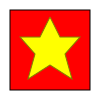
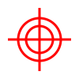
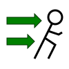

# Ultimate Cat Battle

Ultimate Cat Battle is a turn-based fighting game for Android featuring a cat and a penguin.

It's main characteristics are :
- 1 player mode (computer controls the penguin) or 2 player mode on the same device
- Free, no ads, no internet connection needed
- Fast pacing : a game should last a couple of minutes
- Playable by anyone over 7 years old
- Available languages : English, French

# Download and install

You can download the APK in the release page (you'll have to configure your smartphone/tablet do allow
third-party APK installations).

If it becomes popular enough to allow the required number of testers, I'll try have it published to
the Google Play Store.

# Game instructions

## Introduction

The Cat and the Penguin had a long-standing enmity dating back to a hundred generations. The cause of
this conflict has been forgotten with the ages, but the hatred still remains.

Being the sole survivors of their clans, they decided to settle this once and for all in an ultimate
battle where only one of them will be left standing. Who will emerge victorious ?

## Gameplay basics

There are 2 players : the cat (controlled by the first player) and the penguin (either controlled by
the second player in 2-player mode or the computer in 1-player mode). Both of them starts with an amount
of hit points. The goal is to decrease the number of enemy hit points to 0 before the opponent does
the same to you.

You can see the number of hit points you and our opponent have by looking at the number near the heart
icon : 

You can select between two types of moves during your turn :
- Attack moves which does damage (decreases hit points)
- Support moves which will modify your statistics (e.g. : increase damage dealt, ...)

## Time management

The most important resource in this game is `time`. At the beginning of the same, one player is randomly
chosen and given a random (< 20) amount of time units. The number of time units remaining for the current
player is displayed near the clock icon : 

Each move costs a fixed amount of time. when you select a move, if its cost is lower than your
remaining amount of time, you will be able to use another move, otherwise you opponent turn will begin.

Apart from the first turn, the amount of time available for a player depends is the difference between
the time cost of its opponent last move and its opponent last remaining time. For example :
- The Cat starts with 15 remaining time. 
- The Cat then uses the `Berserk` support move, which costs 10 time units. He has now 5 units of time remaining
  (15 initial time - 10 from the move), so he can play again
- The Cat then uses the `Heart strike` attack move, which costs 50 time units. Since the move has a greater
cost than Cat's remaining time, it will be Penguin's turn to play next. At the start of Penguin's turn,
he will have 45 time units (50 units from Cat's last move - 5 units for Cat's remaining time before the move).

## Attack moves

Attack moves are displayed as red/pink buttons in the move selection screen.

As their name implies, the purpose of attack moves is to reduce the number of enemy hit points. As said
in the previous section, it has a time cost (note that it will be applied regardless of whether the attack
succeeded, was critical or just failed).

By default the interface will only display the name of the attack along with its time cost, you can display
more of its characteristics by clicking of the `+` button in the move selection screen : 

### Damage

An important information about an attack is its base damage. Each attack has a damage range from which
the actual damage value will be chosen randomly (before applying damage modifiers). Damage range can
be seen in the attack details next to the crossed swords icon : 

The effective damage dealt is also affected by the player attack modifier (positively) and the opponent
defense modifier (negatively). Those modifiers are percentage-based and additive, which means that if
the attacker has a 25 (=25 %) attack modifier and the opponent has a 25 (=25 %) defense modifier, both
modifiers will cancel each-other.

The minimum damage done is always 1 (which only happens when the attacker has a -50 % attack modifier
and the defender has a 50 % defense modifier).

### Hit chance

Attacks can miss (and you'll be sad when it will happen, as you won't do any damage and will still pay
the time cost). When a user performs an attack action, a first random draw will be done in order to
check if the attack has succeeded or not.

Each attack move has a base chance of success, showed in the details near the arrow target icon : 

If the base hit chance is greater or equal than 100, an attack will never miss. An attack with a hit
chance of 50 will miss half of the time (in theory, don't complain to me about the RNG).

Like for damage done, hit chance can also be subject to status modifiers. The attacker hit rating will
increase its chance (e.g. : 60 % base hit from move and 20 % player hit rating = 80 % chance), while
the defender avoidance rating will decrease its change (e.g. : 60 % base hit from move and 10 % opponent
avoidance rating = 50 % chance).

### Critical chance

If you're lucky, attacks can trigger critical hits, which will add 50 % extra damage (after all
modifiers are applied) for the same time cost.

Whether an attack is critical or not is computed *after* checking whether an attack was successful or
not. Even if you had a 100 % critical hit chance, it will have no effect if your attack missed.

Each attack move has a base chance (in percents) of critical hit, showed in the details near the star
target : 

Critical chance can also be modified by the player critical modifier (e.g. : 10 % base critical from
move and 20 % player critical modifier = 30 % critical chance). Unlike for damage and hit rating, there
is no modifier for the opponent in order to reduce critical hit.

## Support moves

Support moves are displayed as green buttons in the move selection screen.

A support move applies a set of modifiers to the player for a set amount of time (move cost + 100 time units).
You can cumulate as many modifiers as you want, however there is a limit applied to the total modifier
value on each stat (no less than -50 %, no more than 50 %). For example if you apply 3 `Berserk` moves,
your total attack modifier will only be 50 % instead of 75 %, however once the first `Berserk` modifier
expires, the attack modifier will still stays at 50 % until the second one expires.

Not all modifications are positive, actually most support moves tend to apply a positive modifier on
some stats and a negative modifier on others. For example `Berserk` will increase your attack
at the cost of decreasing your defense, while `Guard` will do the opposite.

Before applying a support move, you should check whether the decreases on some stats are worth in increase
in others (beware of the 50 % limit), and also if it's worth the time cost which can also be used on attacks.

By default the interface will only display the name of the attack along with its time cost, you can display
more of its characteristics by clicking of the `+` button in the move selection screen : 

You can see the cumulative values of the stats modifier in the main screen, below the Hit Points value.
There are 5 statistics modifiers :

- Attack modifier (increases damage dealt) : 
- Defense modifier (decreases damage received) : 
- Hit modifier (increases attack success rate) : 
- Avoidance modifier (decreases enemy attack success rate) : 
- Critical modifier (increases critical chance) : 

## Conclusion

As they say, you'll be more familiar with the rules by playing a few rounds, so go play and try to
have some fun. If you have some improvements or suggestions do not hesitate to create an issue.
