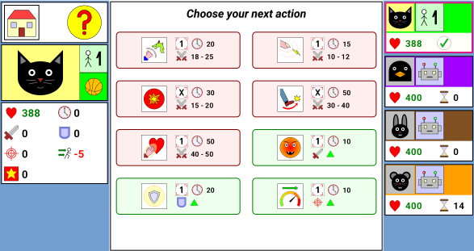

# Ultimate Cat Battle

Ultimate Cat Battle is a turn-based fighting game for Android featuring a cat and a penguin.

It's main characteristics are :
- 1 player mode (against the computer) or up to 4 players on the same device
- Organize your teams and try different setups : free for all, cooperative, 1 vs 3 boss mode, ...
- Free, no ads, no internet connection needed
- Fast pacing : a game should last a couple of minutes
- Playable by anyone over 7 years old
- Available languages : English, French

# Download and install

The game is available on [Google Play](https://play.google.com/store/apps/details?id=org.deathdric.ultimatecatbattle).
If you are having any trouble regarding access on Google Play, please [send me an email](mailto:cmotsch@free.fr?subject=Ultimate%20Cat%20Battle).

You can download the APK in the release page and install it manually (you'll have to configure your smartphone/tablet do allow
third-party APK installations). It is only recommended for power users as it is not the best security practice.

# Game instructions

You can get detailed information by clicking the help icon at any stage of the game : 

First step is to choose the number of players (1 to 4). Then you assign characters to each player including the computer
(note that you can add characters up to 4). Then, if there are more than 2 parties involved, you assign players into teams,
and finally you can start the game.

One of the most important aspect of the game is time management, each action costs an amount of time, which determines whether you will be able
to perform another action before the next player turn. Some moves even have cooldown timers, which means that you will have
to wait before being able to use them again.

There are two types of moves : attack moves which deals damage and support moves which modifies your (or your ally's) stats.
Some attack moves target a single enemy while others can target all of them. Attacks can miss (check your hit rating) or can
be critical and deal more damage. Some attacks even have a chance to lower enemy stat or delay their turn.

The game ends when only one human team still has remaining active characters, or if only computer teams still have them.

But enough talking, just install the game and see for yourself !

